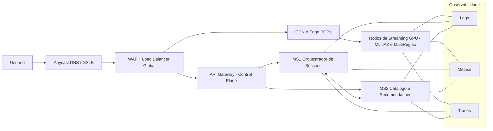

# 🎮 GameStream — Arquitetura de Referência (Escalabilidade e Resiliência)

## 📘 Contexto

A **TechCorp**, empresa de tecnologia, está desenvolvendo o **GameStream**, um serviço de **streaming de jogos em nuvem** voltado para oferecer jogabilidade com alta qualidade e baixa latência.  
A meta é alcançar **1 milhão de usuários nos primeiros seis meses**, garantindo **escalabilidade, desempenho e disponibilidade contínua**.

Como arquiteto de soluções, o papel é projetar uma **Arquitetura de Referência inicial** que suporte o crescimento e mantenha o serviço estável mesmo sob alta demanda ou falhas regionais.

---

## 🧩 1) Divisão da Aplicação (Microsserviços e Desacoplamento)

### 🔹 Microsserviço 1 — Orquestrador de Sessões de Jogo
- **Função:** cria, gerencia e encerra sessões de jogo nos servidores com GPU, conectando cada jogador à instância mais próxima e estável.  
- **Por que é crítico:** é responsável por todo o controle das sessões ativas e alocação de recursos.  
- **Se falhar:** apenas novas sessões ficam temporariamente indisponíveis, mas as partidas em andamento continuam normalmente.

---

### 🔹 Microsserviço 2 — Catálogo e Recomendações
- **Função:** exibe a lista de jogos disponíveis, metadados (descrição, imagens, trailers) e faz recomendações personalizadas com base no histórico do usuário.  
- **Por que é crítico:** é a porta de entrada da experiência do jogador antes de iniciar o streaming.  
- **Se falhar:** o sistema continua funcionando usando **cache/CDN**, mantendo o catálogo básico acessível. Nenhum jogo ativo é interrompido.

---

### 🔹 Mecanismo de Comunicação
- **Tipo:** comunicação **assíncrona por eventos**, garantindo que os microsserviços sejam independentes.  
- **Serviços de cloud possíveis:** AWS SNS+SQS, GCP Pub/Sub, Azure Service Bus.  
- **Motivo:** se um microsserviço cair, o outro continua processando mensagens normalmente.  
- **Boas práticas:** uso de **retentativas**, **fila morta (DLQ)**, **idempotência** e **circuit breaker** para evitar falhas em cascata.

---

## 🌍 2) Alta Resiliência e Disponibilidade (Geografia)

### 🔹 Conceito de Distribuição
- Distribuir a aplicação em **múltiplas Zonas de Disponibilidade (AZs)** dentro de cada região e replicar os serviços em **várias regiões** (modelo ativo-ativo).  
- Utilizar **CDN (Content Delivery Network)** e **servidores de borda (Edge POPs)** para entregar o conteúdo com a menor latência possível.  
- Controlar o roteamento global com **GSLB (Global Server Load Balancing)** ou **Anycast DNS**.

### 🔹 Justificativa
- Se uma zona ou até uma região inteira falhar, o sistema continua operando a partir de outra.  
- Isso garante **alta disponibilidade**, **baixa latência** e **resiliência global**, mantendo a jogabilidade estável mesmo com falhas locais.  
- A CDN ainda reduz a carga nos servidores principais, melhorando o desempenho e economizando recursos.

---

## ⚖️ 3) Escalabilidade de Tráfego (Entrada)

### 🔹 Serviço Necessário
- O primeiro componente a receber requisições é o **Balanceador de Carga Global (Camada 7)** com **WAF (Web Application Firewall)** e **Auto Scaling**.

**Exemplos:** AWS Application Load Balancer + Global Accelerator; GCP Cloud Load Balancing; Azure Front Door + App Gateway.

### 🔹 Função
- O balanceador recebe o tráfego dos usuários e o distribui entre os servidores disponíveis de forma **inteligente** e **dinâmica**.  
- Ele monitora o estado de cada instância, cria novas conforme a demanda e desativa as que estão ociosas.  
- Também aplica **rate limiting** e **proteção com WAF**, garantindo que nenhum servidor seja sobrecarregado.

---

## 🔒 4) Segurança por Design (Identity and Access)

### 🔹 Pilar de Segurança
- **IAM (Identity and Access Management)** seguindo o modelo **Zero-Trust**, onde todo serviço precisa provar sua identidade para se comunicar com outro.

### 🔹 Por que é essencial
- Assegura que apenas o **Microsserviço 1 (autenticado)** possa acessar o **Microsserviço 2**, evitando chamadas indevidas e ataques laterais.  
- Implementado com **mTLS (mutual TLS)**, **OAuth2**, **JWT Tokens** e **RBAC (Role-Based Access Control)**.  
- Tudo baseado no princípio do **menor privilégio**, garantindo acesso mínimo e seguro entre serviços.

---

## 🧭 5) Diagrama de Arquitetura (Mermaid)

*Observacao: removi acentos e labels nas arestas para compatibilidade total com o render do GitHub.*

---

## ✅ Resumo Final

| Pergunta | Resposta curta |
|-----------|----------------|
| **1. Microsserviços** | MS1: Orquestrador de Sessões / MS2: Catálogo & Recomendações / Comunicação assíncrona |
| **2. Disponibilidade** | Multi-AZ + Multi-Região + CDN + GSLB |
| **3. Escalabilidade** | Balanceador L7 global + Auto Scaling + WAF |
| **4. Segurança** | IAM + Zero-Trust + mTLS + OAuth2 + RBAC |

---

## ✍️ Conclusão

A arquitetura proposta garante que o **GameStream** seja **rápido, estável e seguro**.  
Mesmo com falhas regionais ou aumento repentino de usuários, o sistema se adapta automaticamente.  
Com microsserviços independentes, balanceamento global e autenticação entre serviços, o GameStream oferece **resiliência, escalabilidade e confiança**, atendendo milhões de jogadores sem interrupções.

---

📌 **Autores:**  
- José Luiz  
- Leandro Duarte  
- Rafael Maruca  

📅 **Data:** Outubro / 2025  
📚 **Disciplina:** Arquitetura de Soluções em Cloud  
🏫 **Instituição:** Faculdade de Tecnologia
